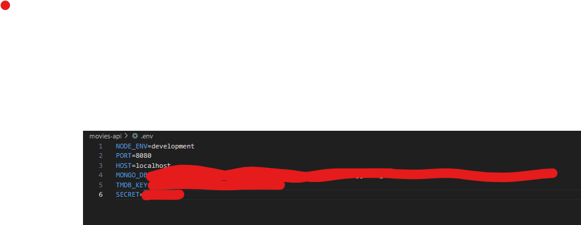
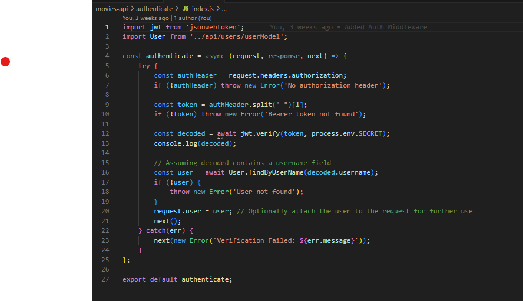
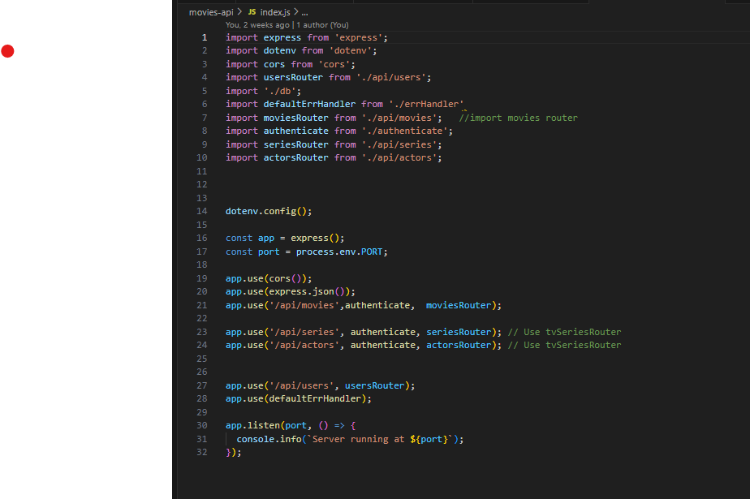

# Assignment 2 - Web API.

Name: Elizabeth Neary

## Features.
 
 + Feature 1 
 + Feature 2 
 + Feature 3 
 + etc

## Setup requirements.

For the setup of this assignment I created a a new branch from wad-labs-2023 called WebAPIReactCA. This is where all my commits will be made to with changes made upon the API App.

## API Configuration

For the configuration of the API , a new file is created in the main directory called .env. Automatically this file is used to store private enivronment variables 
which are key-value pairs representing configuration settings for the application. These variables can include sensitive information like API keys, database URLs, or other settings specific to the development or production environment. Below are environment variables stored specifically for the API: 

+ NODE_ENV=development: This variable is used to specify the environment the application will run in. In this case, it is set to "development." Setting the environment helps the application adjust its behavior based on whether it's in development, production, or another environment.

+ PORT=8080: This is the port number where the application will listen for incoming requests. In this case, it's set to 8080. When the application runs, it will be accessible through http://localhost:8080 in the browser. Port can be changed if needed.

+ HOST=localhost: This variable specifies the host or IP address where your application is running. In this case, it's set to localhost, meaning the application is accessible on the local machine. 

+ SECRET= : This variable is an example of a secret key or token. It could be used for various purposes, such as encrypting session data, generating secure tokens, or any scenario where you need a secret value. 

+ MONGO_DB: This is the connection string for mt movies MongoDB database.

+ TMDB_KEY: This is a placeholder for the TMDB Movies API key.

## API Design
Give an overview of your web API design, perhaps similar to the following: 

- /api/movies | GET | Gets a list of movies 
- /api/movies/{movieid} | GET | Gets a single movie 
- /api/movies/tmdb/upcoming | GET | Gets upcoming movies
- /api/movies/tmdb/genres | GET | Gets movie genres
- /api/movies/tmdb/top-rated | GET | Gets top rated movies
- /api/movies/tmdb/now-playing | GET | Gets movies now playing in cinemas
- /api/movies/tmdb/movie/:id | GET | Gets details of that movie 
- /api/movies/search | GET | Gets search result back for movies

- /api/series | GET | Gets series
- /api/series/{serieid} | GET | Gets a single series
- /api/series/tmdb/popular | GET | Gets popular tv series
- /api/series/tmdb/serie/{serieid} | GET | Gets single series details

- /api/actors | GET | Gets famous actors and actresses
- /api/actors/{actorid} | GET | Gets single actor/actress
- /api/actors/tmdb/popular | GET | Gets most popular actors/actresses
- /api/actors/tmdb/actor/{actorid} | GET | Gets single actor details
- /api/actors/tmdb/{actorid}/movie-credits | GET | Gets movie credits of a person

- /api/users | GET | Gets all users
- /api/users | POST | Posts a new user to app
- /api/users | PUT | Puts - updates a users details

## Security and Authentication

Implemented in the API is the authenticate middleware. This is a security measure implemented to ensure that certain routes are only accessible to authenticated users. This middleware, defined in a separate file (index.js in authenticate folder) checks whether the incoming request is associated with an authenticated user session. If the user is authenticated, the request is allowed to proceed to the intended route; otherwise, a 401 Unauthorized response is sent, indicating that the user lacks the necessary credentials. In the main application file (e.g., index.js), this middleware is applied to specific routes using app.use('/path', authenticate, routeHandler), thereby safeguarding those routes and ensuring that only authenticated users can access them.

## Integrating with React App

I tried to attempt integration and ran into a lot of difficulties with the app and everything just constantly crashing and working

